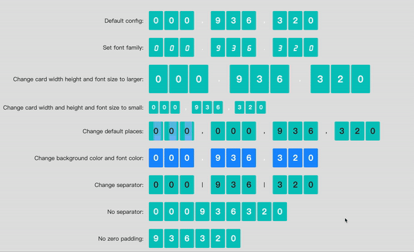

# vue-flop-card

[](https://www.npmjs.com/package/vue-flop-card)
[](https://www.npmjs.com/package/vue-flop-card)
[](https://www.npmjs.com/package/vue-flop-card)

This is a flop card for vuejs,
A digital card flop, usually used in data analysis and large-screen projects

Feel free to report issues, fork, send feature/pull-requests, or reuse for whatever purpose you see fit.

## Preview



## Installation

```bash
npm install vue-flop-card --save
```

## Getting started

### Global registration

Within a Vue project, add these lines in your main.js or index.js;

```js
import Vue from 'vue';
import VueFlopCard from 'vue-flop-card';

Vue.use(VueFlopCard);
```

### Local registration

```js
import VueFlopCard from "vue-flop-card";

export default {
    components: {VueFlopCard}
}
```

## Example usage

Component usage content:

```vue
data(){
  return {
    earAmount: 0
  }
}

<vue-flop-card
    :amount="earAmount"
    :places="9"
    :flop-width="45"
    :flop-height="60">
</vue-flop-card>
```

## Props

Prop | Type | Default Value | Description
:---: | :---: | :---: | ---
**amount** | *Number* | *0* | Card numerical value
**background-color** | *String* | *#05c8c0* | Card background color
**color** | *String* (enum) | *#FFFFFF* | Card font color
**separator** | *String* | *,* | Separator
**places** | *Number* | *9* | The flop card places
**flop-width** | *Number* | 22 | flop item card width
**flop-height** | *Object* | 38 | flop item card width
**font-size** | *Number* | 26 | flop item card font size
**font-family** | *String* | - | flop item card font family
**is-coverage** | *Boolean* | true | IS zero padding
**is-separator** | *Boolean* | *true* | Is show separator

## License

Copyright (c) 2021 BZ-koko
